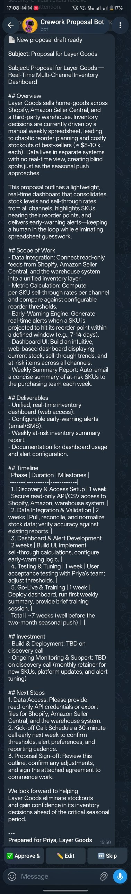
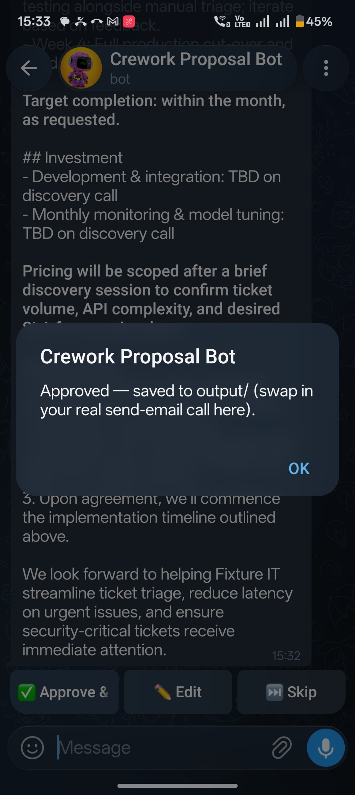
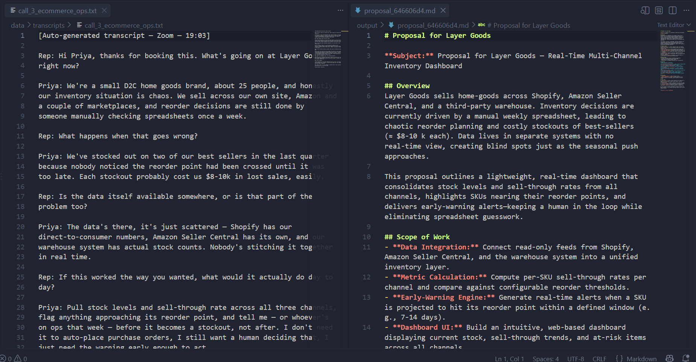

# I Built an AI That Drafts Your Sales Proposal Before You've Even Left the Call

### It reads the transcript, finds the closest deal we've closed before, and has a draft waiting on my phone in under a minute.

**TLDR:** Sales-led SMBs lose momentum in the gap between a good call and a
proposal actually reaching the prospect's inbox — the exact window when
the founder is most likely to get pulled into something else. This
walks through a system that reads a call transcript the moment it's
available, pulls out what the prospect actually asked for, finds the
past proposal closest to it, drafts a new one in that shape, and sends
it to my phone for a one-tap approve before it ever reaches a real
inbox.

---

## What's Inside

- The topic I chose, and why
- Step 1: The transcripts
- Step 2: The extraction agent
- Step 3: Retrieval against past proposals
- Step 4: The drafting agent
- Step 5: The approval loop
- Step 6: Testing the full pipeline
- Final result
- Limitations
- Other topics I considered
- Bonus: taking this further

*(Tools used: Python, FastAPI, LangGraph, Groq (`llama-3.3-70b-versatile`),
sentence-transformers + FAISS for retrieval, Telegram Bot API, ngrok)*

**Code:** https://github.com/DevendraVeer/crework-proposal-agent

---

## The topic I chose, and why

I picked the sales-call-to-proposal builder over the Instagram DM agent.

Two reasons. First, it's the one where the risk is in the AI logic, not
in a third-party API's mood that day — no Meta webhook permissions to
fight with under a 3-day clock. Second, it's a direct extension of work
I'd already done: I'd built a RAG assistant before this and hit (and
fixed) a real chunking bug that came from treating retrieval as an
afterthought instead of a first-class design decision. This build is
that same discipline applied somewhere new — extraction and retrieval
are kept as two separate, deliberately narrow steps instead of one prompt
trying to do everything.

I also wanted to build with raw model calls and my own orchestration —
FastAPI, LangGraph, Groq directly — rather than a no-code automation
recipe. Not because that approach is wrong, it isn't, but because it's
not the muscle I wanted to demonstrate here.

---

## Step 1: The transcripts

No real sales call to pull from, so I wrote three realistic ones covering
different slices of the ICP: a boutique marketing agency losing Instagram
leads to slow replies, an IT managed services company drowning in manual
ticket triage, and a small ecommerce brand stocking out because inventory
data is scattered across three platforms. Each one has the details a real
call would: a name, a specific pain point, some budget language, a
timeline, and who the actual decision-maker is.

---

## Step 2: The extraction agent

**Key point:** the model never sees the raw transcript and the past
proposals at the same time. It sees the transcript once, extracts eight
clean fields, and that's the only thing that gets passed forward.

A low-temperature Groq call turns the transcript into structured JSON —
client name, company, industry, pain points, what they actually asked to
be built, any budget or timeline language, whether they're the actual
decision-maker, and urgency. Validated against a Pydantic schema before
it's trusted anywhere downstream, so a malformed response fails loud
instead of silently corrupting the draft three steps later.

---

## Step 3: Retrieval against past proposals

**Key point:** the system doesn't write a proposal from a blank page. It
finds the closest thing we've already sent to a similar client and drafts
from there.

Five past proposals — lead intelligence automation, a coaching CRM
onboarding flow, helpdesk ticket triage, inventory monitoring, and a
consulting-firm onboarding sequence — are embedded locally
(sentence-transformers, no external embedding API) and indexed in FAISS.
The extracted call data becomes the query. Whichever past proposal is
closest by industry, requested deliverables, and pain points wins, and
its similarity score comes along for the ride so I can see how confident
the match actually was.

---

## Step 4: The drafting agent

**Key point:** the retrieved proposal is a structural and tonal reference,
never a source of facts. The system prompt explicitly forbids the model
from copying its client name, numbers, or scope into the new draft —
every fact in the new proposal has to trace back to the actual call.

This is the step that took the most iteration. Early drafts occasionally
leaked a stray detail from the reference proposal (a dollar figure that
belonged to the old client, not the new one) before I tightened the
system prompt to call that out explicitly and add a fallback: if budget
or timeline wasn't actually discussed, the model has to write
`[TBD on discovery call]` instead of guessing a number.

---

## Step 5: The approval loop

**Key point:** nothing goes to a real prospect without a human tapping
Approve first.

The draft is pushed to Telegram as a message with three inline buttons —
Approve & Send, Edit, Skip. A FastAPI webhook receives the button press;
Approve writes the finalized proposal to disk (the exact point where a
real "send via Gmail API" call would slot in for production), Skip just
logs it, Edit is flagged for a manual follow-up pass.

---

## Step 6: Testing the full pipeline

Ran all three sample transcripts through end to end. All three produced
a usable first draft; one needed a heavier edit than the other two (see
Limitations). Full loop — transcript in, structured extraction, retrieval
match, drafted proposal, phone approval, saved output — worked without
manual intervention on all three.

   
---

## Final result

---

## Limitations

Being honest about where this doesn't fully hold up, because pretending
otherwise isn't useful to anyone:

- **Retrieval quality depends on how well the past-proposal corpus
  covers the ICP.** With only five reference documents, an unusual
  request (something none of the five resemble) will still get matched
  to whichever is *least bad*, and the draft quality drops accordingly.
  This scales cleanly by just adding more real past proposals over time.
- **The drafting agent is honest about missing budget/timeline data, but
  that's also a limitation** — a real proposal often needs a number even
  when the call didn't produce one, and `[TBD on discovery call]` is a
  placeholder a human still has to fill in before sending.
- **This reads a finished transcript, it doesn't listen live.** If the
  business is on Zoom/Meet/Teams, the auto-generated transcript is
  usually available within minutes of the call ending, which is close
  enough to "right after the call" for the response-speed win to hold.
- **Five sample transcripts and five past proposals were hand-written for
  this build**, not pulled from a real CRM. On day one with a real
  business, both corpora would need to be swapped in — the pipeline
  itself doesn't change, just the data behind it.
- **The Edit button is intentionally scoped out.** Approve and Skip are
  fully wired end to end. Edit flags the draft for manual follow-up
  rather than looping back into an auto-redraft — a real version would
  need to hold conversation state to capture the revised text and
  reprocess it, and that felt like the right thing to cut given the
  time budget rather than ship half-working.

---

## Other topics I considered

Given the ICP and the goal of shipping something that solves a real,
specific pain rather than a generic "AI does X":

1. **Overdue invoice follow-up escalation** — AI monitors payment status
   and drafts progressively firmer (but still polite) follow-ups keyed
   to days-overdue, instead of a founder having to remember to chase.
2. **Post-delivery review request timing** — drafts a personalized
   review ask timed to go out when satisfaction is statistically highest
   (right after delivery/close), instead of a generic blast weeks later.
3. **Inbound applicant screening triage** — reads resumes/applications
   against a rubric and drafts either an interview invite or a
   respectful decline, for businesses hiring at a volume where manual
   screening is the bottleneck.
4. **Contract renewal / churn risk watch** — cross-references contract
   end dates with recent support-ticket sentiment and flags at-risk
   accounts with a drafted retention outreach before the renewal
   conversation becomes reactive.

---

## Bonus: taking this further

- **Auto-detect the channel.** Right now this assumes a transcript file.
  A production version would watch a shared drive folder for new
  Zoom/Meet/Teams auto-transcripts and trigger automatically.
- **Grow the retrieval corpus automatically.** Every proposal that
  actually gets a client to sign gets added back into the index, so the
  system's reference set improves with every closed deal instead of
  staying fixed at five documents.
- **Add a confidence gate.** If the retrieval similarity score comes back
  low, route the draft to "needs manual review" instead of the normal
  one-tap approval — the system should know when it doesn't know.
- **Swap FAISS for Qdrant at scale.** Fine as-is for a handful of past
  proposals; the moment that corpus grows into the hundreds, metadata
  filtering (by industry, by deal size) earns its keep.
